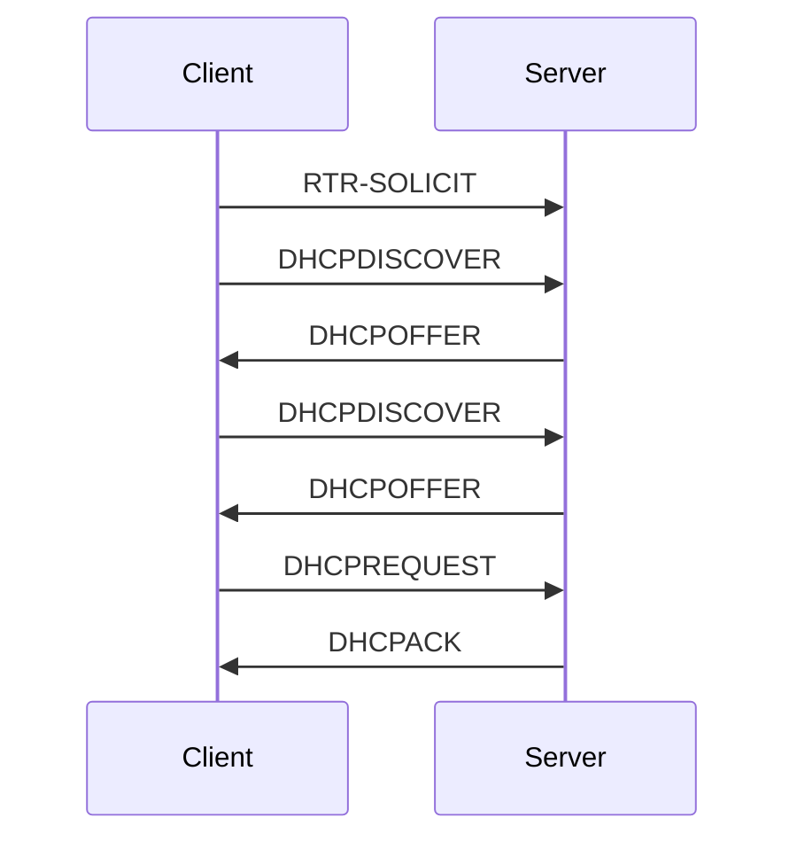
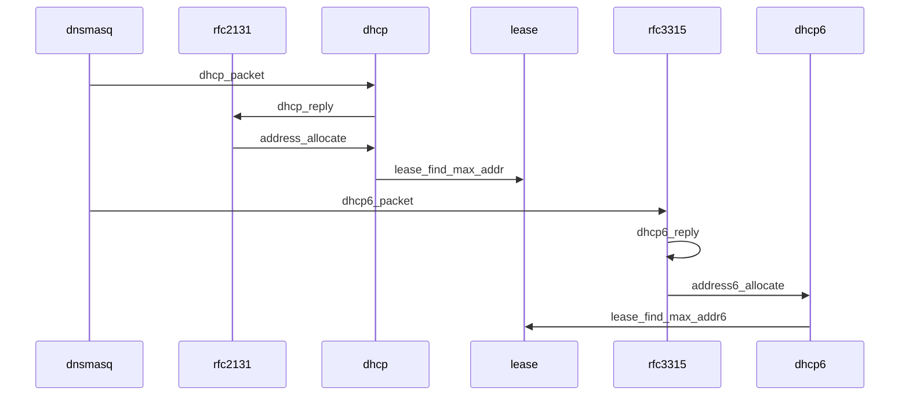
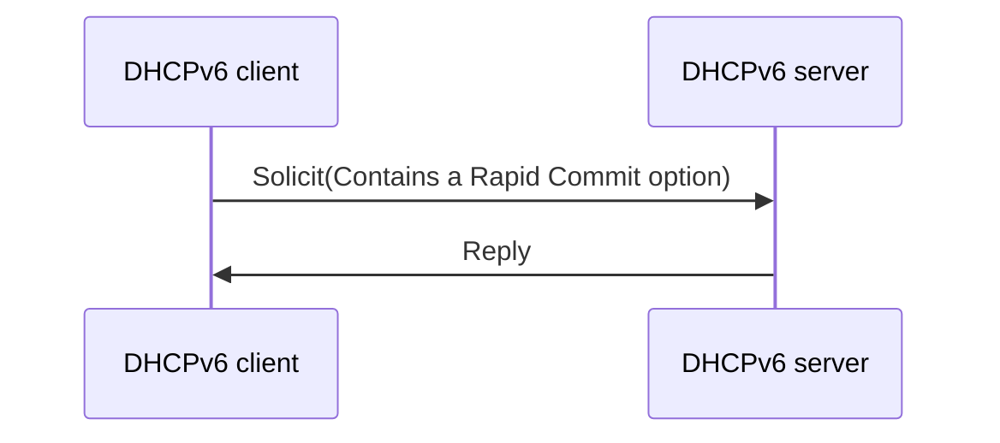
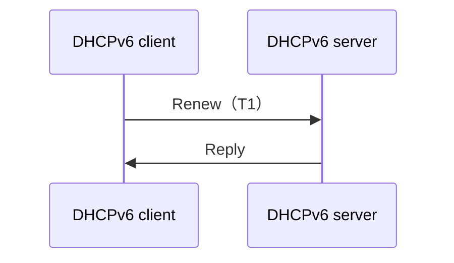
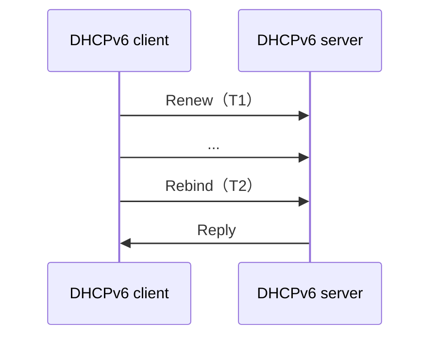

[TOC]
# dnsmasq ndk编译

## 准备
安装ndk r21e

## 编译
```
ndk-build NDK_PROJECT_PATH=. APP_BUILD_SCRIPT=Android.mk
```

## 运行

```
./dnsmasq --keep-in-foreground --no-resolv --no-poll --dhcp-authoritative --dhcp-option-force=43,ANDROID_METERED --pid-file --user=dns_tether --dhcp-range=192.168.42.2,192.168.42.254,1h --dhcp-range=192.168.43.2,192.168.43.254,1h --dhcp-range=192.168.44.2,192.168.44.254,1h --dhcp-range=192.168.45.2,192.168.45.254,1h --dhcp-range=192.168.46.2,192.168.46.254,1h --dhcp-range=192.168.47.2,192.168.47.254,1h --dhcp-range=192.168.48.2,192.168.48.254,1h --dhcp-range=192.168.49.101,192.168.49.254,1h --dhcp-range=192.168.50.2,192.168.50.254,1h --dhcp-range=fd98:99d6:cd55:0:100::,fd98:99d6:cd55:0:1ff::,ra-names,slaac,2h -q -d

```


# 架构

## 租约展期
```
dnsmasq-dhcp: RTR-SOLICIT(p2p-p2p0-6) 54:55:d5:77:dc:58
dnsmasq-dhcp: DHCPDISCOVER(p2p-p2p0-6) 54:55:d5:77:dc:58
dnsmasq-dhcp: DHCPOFFER(p2p-p2p0-6) 192.168.49.137 54:55:d5:77:dc:58
dnsmasq-dhcp: DHCPDISCOVER(p2p-p2p0-6) 54:55:d5:77:dc:58
dnsmasq-dhcp: DHCPOFFER(p2p-p2p0-6) 192.168.49.137 54:55:d5:77:dc:58
dnsmasq-dhcp: DHCPREQUEST(p2p-p2p0-6) 192.168.49.137 54:55:d5:77:dc:58
dnsmasq-dhcp: DHCPACK(p2p-p2p0-6) 192.168.49.137 54:55:d5:77:dc:58 WGRR-W09
```



### 简短
```
dnsmasq-dhcp: DHCPREQUEST(p2p-p2p0-10) 192.168.49.168 54:55:d5:77:dc:58
dnsmasq-dhcp: DHCPACK(p2p-p2p0-10) 192.168.49.168 54:55:d5:77:dc:58 WGRR-W09
dnsmasq-dhcp: RTR-SOLICIT(p2p-p2p0-10) 54:55:d5:77:dc:58
```


## 调用序列


# 关于dhcp6

## 简介
DHCPv6是一个用来配置工作在IPv6网络上的IPv6主机所需的IP地址、IP前缀和/或其他配置的网络协议。
与IPv4通过DHCP下发地址方式不同的是，IPv6地址可以不通过DHCP方式获取。归功于IPv6所支持的无状态地址配置机制，由RFC4862定义。  
IPv6主机可以使用无状态地址自动配置（SLAAC）或DHCPv6来获得IP地址。DHCP倾向于被用在需要集中管理主机的站点，而无状态自动配置不需要任何集中管理，因此后者更多地被用在典型家庭网络这样的场景下。  
使用无状态自动配置的IPv6主机可能会需要除了IP地址以外的其他信息。DHCPv6可被用来获取这样的信息，哪怕这些信息对于配置IP地址毫无用处。配置DNS服务器无需使用DHCPv6，它们可以使用无状态自动配置所需的邻居发现协议来进行配置。  
IPv6路由器，如家庭路由器，必须在无需人工干预的情况下被自动配置。这样的路由器不仅需要一个IPv6地址用来与上游路由器通信，还需要一个IPv6前缀用来配置下游的设备。DHCPv6前缀代理提供了配置此类路由器的机制。 [1]


## RFC标准
|协议|编码|
|----|----|
|DNS  - Domain Name System|	RFC881  ( EN CN )|
||RFC882   ( EN CN )|
||RFC883   ( EN CN )|
||RFC1034  ( EN CN )|
||**RFC1035**  ( EN CN )|
|BOOTP  - Bootstrap Protocol|	RFC951   ( EN CN )|
|DHCP  - Dynamic Host Configuration Protocol	|RFC1531  ( EN CN )|
||RFC1541  ( EN CN )|
||**RFC2131**  ( EN CN )|
|DHCP v6|	**RFC3315**  ( EN CN )|
||RFC4580  ( EN CN )|
||RFC4649  ( EN CN )|
||RFC4704  ( EN CN )|

## 实现
### 端口号
DHCPv6客户端使用UDP端口号546，服务器使用端口号547。

### DHCP唯一标识符
DHCP唯一标识符（DUID）用于客户端从DHCPv6服务器获得IP地址。最小长度为12个字节（96位），最大长度为20字节（160位）。实际长度取决于其类型。服务器将DUID与其数据库进行比较，并将配置数据（地址、租期、DNS服务器，等等）发送给客户端。DUID的前16位包含了DUID的三种类型之一。剩余的96位取决于DUID类型。

### 举例
本例中，服务器的链路本地地址是fe80::0011:22ff:fe33:5566，客户端的链路本地地址是fe80::aabb:ccff:fedd:eeff。  
DHCPv6客户端从[fe80::aabb:ccff:fedd:eeff]:546 发送Solicit至 [ff02::1:2]:547。  
DHCPv6服务器从[fe80::0011:22ff:fe33:5566]:547 回应一个Advertise给 [fe80::aabb:ccff:fedd:eeff]:546。  
DHCPv6客户端从[fe80::aabb:ccff:fedd:eeff]:546 回应一个Request给 [ff02::1:2]:547。（依照RFC 3315的section 13，所有客户端消息都发送到多播地址)  
DHCPv6服务器以[fe80::0011:22ff:fe33:5566]:547 到[fe80::aabb:ccff:fedd:eeff]:546 的Reply结束。 [1]


|DHCPv6 消息|	描述|	等效的 DHCPv4 消息|
|------|------|------|
|要求（solicit）	|由客户端发送以定位服务器。								      |DHCPDiscover|
|公告（advertise）	|由服务器对 “要求” 消息进行响应时发送以指明可用性。						|DHCPOffer|
|请求（request）	|由客户端发送以请求来自特定服务器的地址或配置设置。						|DHCPRequest|
|确认（confirm）	|由客户端发送给所有服务器，以确定对于已连接的链接客户端的配置是否有效。				|DHCPRequest|
|更新（renew）		|由客户端发送给特定服务器以延长分配地址的生存期并获取更新的配置设置。				|DHCPRequest|
|重新绑定（rebind）	|未接收到对 “更新” 消息的响应时由客户端发送给任何服务器。					|DHCPRequest|
|应答（reply）		|对要求、请求、更新、重新绑定、信息请求、确认、发布或拒绝消息进行响应时由服务器发送给特定客户端。  |DHCPAck|
|发布（release）	|由客户端发送以指明客户端不再使用分配的地址。							|DHCPRelease|
|拒绝（decline）	|由客户端发送给特定服务器以指明分配的地址已在使用中。						|DHCPDecline|
|重新配置（reconfigure）|由服务器发送给客户端以指明该服务器具有新的或更新的配置设置。客户端随后发送 “更新” 或“信息请求”消息。|N/A|
|信息请求（information-request）|由客户端发送以请求配置设置（但不包括地址）。						|DHCPInform|
|中继转发（relay-forw）	|由中继代理发送以转发消息给服务器。中继转发包含封装为 DHCPv6 中继消息选项的客户端消息。		 |N/A|
|中继应答（relay-reply）|由服务器发送以通过中继代理发送消息给客户端。中继应答包含封装为 DHCPv6 中继消息选项的服务器消息。 |N/A|


## 地址配置
### 有状态地址自动配置
在有状态地址自动配置的方式下，DHCPv6 服务器分配一个完整的 IPv6 地址给主机，并提供 DNS 服务器地址和域名等其它配置信息，这中间可能通过中继代理转交 DHCPv6 报文，而且最终服务器能把分配的 IPv6 地址和客户端的绑定关系记录在案，从而增强了网络的可管理性。

DPCHv6 地址池的计算，管理全部是服务器端在做，客户端只是简单的从服务器端取得服务器端已经计算好的地址和其他设置应用到自己身上。

### 续约


### 地址冲突
如果DHCPv6客户端发现服务器分配的地址已经被其它节点占用，客户端要向服务器发出DECLINE报文，通知冲突地址的发生，服务器回应以REPLY消息。

### 租约确认
DHCPv6客户端链路因某种原因中断又恢复，或者客户端连接到新的链路以后，客户端要向服务器发送CONFIRM报文希望确定当前被分配的地址是否仍然适合连接的链路。服务器回应REPLY报文或不作响应。

### 释放地址
最后客户端不再使用分配的地址时，向选定的服务器发送RELEASE消息请求服务器回收分配的IPv6地址。

### DHCP包格式
```
struct dhcp_packet {
  u8 op, htype, hlen, hops;
  u32 xid;
  u16 secs, flags;
  struct in_addr ciaddr, yiaddr, siaddr, giaddr;
  u8 chaddr[DHCP_CHADDR_MAX], sname[64], file[128];
  u8 options[312];
};
```
|字段|类型|值|
|-----|-----|-----|
|op     |报文操作类型                       |1：请求报文，2：应答报文|
|htype  |客户端MAC地址类型                  |指明网络类型，1：Ethernet MAC|
|hlen   |客户端MAC地址长度                  |以太网MAC地址长度6|
|hops   |DHCP报文经过的DHCP中继数目         |默认为0.dhcp请求报文每经过一个中继增加1，如果需要经过路由，同样＋1|
|xid    |客户端通过dhcp discover报文发起一次请求报文时选择的随机数       	|相当于请求标识，一次IP请求过程，所有的xid都是一样的|
|secs   |客户端从获取IP地址或者续约过程开始到现在所消耗的时间，以秒为单位   	 |在没有获取到IP之前，这个值一直为0。|
|flags  |标志位，只使用第15比特（最左边），是广播应答标识位			|0表示单播，1表示广播。|
|ciaddr |dhcp客户端ip地址		    |仅在服务器发送的ACK报文中显示，其他报文均显示0。因为，在ACK之前，IP地址还没有真正分配给客户端。|
|yiaddr |dhcp服务器分配给客户端的IP地址      |仅在dhcp服务器发送的offer和ACK报文中显示，其他报文显示0.|
|siaddr |下一个为dhcp客户端分配IP地址等信息的dhcp服务器IP地址			|仅在dhcp offer、ACK中显示，其他报文均显示0.|
|giaddr |dhcp客户端发出请求报文后经过的第一个dhcp中继的IP地址			|如果没有经过中继，则显示0。|
|chaddr |dhcp客户端MAC地址		    |在每个报文中都会显示对应dhcp客户端的MAC地址。|
|sname  |为dhcp客户端分配IP地址的dhcp服务器名称（DNS域名格式）			|在offer和ACK报文中显示发送报文的dhcp服务器名称，其他报文显示0.|
|file   |dhcp服务器为客户端指定的启动配置文件名称和路径信息			|仅在dhcp offer报文中显示，其他报文中显示为空。|
|options|可选项字段			    |长度可变，格式为TLV“代码+长度+数据”|

## RA报文M/O标志位
设备在获取IPv6地址等信息时，会先发送RS报文请求链路上的路由设备，路由设备受到RS报文后会发送相应的RA报文来表示自身能够提供的IPv6服务类型。  
对于RA报文，根据其M字段和O字段确定其获取IPv6地址的模式：  
1） M字段：管理地址配置标识（Managed Address Configuration）  
M=0，标识为状态地址分配，客户端通过无状态协议（如ND）获得IPv6地址  
M=1，标识有状态地址分配，客户端通过有状态协议（如DHCPv6）获得IPv6地址  
2） O字段：其他有状态配置标识（Other Configuration）  
O=0，标识客户端通过无状态协议（如ND）获取除地址外的其他配置信息  
O=1，标识客户端通过有状态协议（如DHCPv6）获取除地址外设为其他配置信息，如DNS，SIP服务器信息。  
**协议规定，若M=1.则O=1，否则无意义。**

|M|	O|	含义|									描述|
| ----------- | ----------- |----------- |----------- |
|1|	1|	地址和DNS等都从DHCPv6服务器取得|	Stateful DHCPv6|
|0|	1|	地址使用RA广播的prefix+ EUI-64计算出来的接口地址,DNS和其他服务器从DHCPv6取得|	Stateless DHCPv6|
|0|	0|	完全的Stateless配置,仅地址使用RA广播的prefix+ EUI-64计算出来的接口地址|	Stateless AutoConfiguration|

## IETF标准
* RFC 3315, "Dynamic Host Configuration Protocol for IPv6 (DHCPv6)"
* RFC 3319, "Dynamic Host Configuration Protocol (DHCPv6) Options for Session Initiation Protocol (SIP) Servers"
* RFC 3633, "IPv6 Prefix Options for Dynamic Host Configuration Protocol (DHCP) version 6"
* RFC 3646, "DNS Configuration options for Dynamic Host Configuration Protocol for IPv6 (DHCPv6)"
* RFC 3736, "Stateless Dynamic Host Configuration Protocol (DHCP) Service for IPv6"
* RFC 5007, "DHCPv6 Leasequery"
* RFC 6221, "Lightweight DHCPv6 Relay Agent" [1] 

## IPV6地址格式
一个IPv6的地址使用冒号十六进制表示方法：128位的地址每16位分成一段，每个16位的段用十六进制表示并用冒号分隔开，例如：  
一个普通公网IPv6地址：2001:0D12:0000:0000:02AA:0987:FE29:9871  
IPv6地址支持压缩前导零的表示方法，例如上面的地址可以压缩表示为：  
2001:D12:0:0:2AA:987:FE29:9871  
为了进一步精简IPv6地址，当冒号十六进制格式中出现连续几段数值0的位段时，这些段可以压缩为双冒号的表示，例如上面的地址还可以进一步精简表示为：  
2001:D12::2AA:987:FE29:9871  
又例如IPv6的地址FF80:0:0:0:FF:3BA:891:67C2可以进一步精简表示为：  
FE80::FF:3BA:891:67C2  
这里值得注意的是，双冒号只能出现一次。  

## 设备的IPV6的地址形式
通常一个IPV6主机有多个IPV6地址，具体包括以:  
1、链路本地地址  
2、单播地址  
3、环回地址


## IPV6在Android实例

### IPv6的两种单播地址类型
- 本地链路地址  
IPv6的地址类型。IPv6单播地址可以分为本地链路地址和全局地址。  
IPv6本地链路地址以fe80::/10开头，通常由系统自动为每个网络设备生成。例如下图中的fe80::250:56ff:fe86:1b10就是IPv6 link local地址。  
有了这个地址，在同一个交换机下面的机器就能直接通过这个地址通讯啦，不需要再配置别的地址。  
- 全局地址
全局地址是通过IPv6前缀下发所拿到的一个全局可达的IPv6地址，例如下图中的fd4d:e0f1:f1db::250:56ff:fe86:1b10。有了这个全局IPv6地址，就能跟世界上任何一个IPv6全局地址通讯了，类似于通俗说的公网地址。所以IPv6本地链路地址只有本地链路可达，而IPv6全局地址则所有IPv6网络都可达。  


### ifconfig的显示
```
wlan0     Link encap:Ethernet  HWaddr 52:ae:84:0d:c2:80
          inet addr:192.168.137.235  Bcast:192.168.137.255  Mask:255.255.255.0
          inet6 addr: fe80::50ae:84ff:fe0d:c280/64 Scope: Link  	
          // 本地链路地址，只用于与路由器直接通信(前缀+MAC地址生成)
          UP BROADCAST RUNNING MULTICAST  MTU:1500  Metric:1
          RX packets:1176132 errors:0 dropped:0 overruns:0 frame:0
          TX packets:1538426 errors:0 dropped:0 overruns:0 carrier:0
          collisions:0 txqueuelen:1000
          RX bytes:83630192 TX bytes:1108413359

p2p-p2p0-1 Link encap:Ethernet  HWaddr d2:80:e8:2c:8b:0c
          inet addr:192.168.49.1  Bcast:192.168.49.255  Mask:255.255.255.0
          inet6 addr: fd98:99d6:cd55:0:884b:c1e8:2321:8357/64 Scope: Global 
          // 基于地址前缀生成，后部随机，隐私IP，用于与外部通信 (前缀+随机地址生成)
          inet6 addr: fe80::d080:e8ff:fe2c:8b0c/64 Scope: Link 		    
          // 本地链路地址，只用于与路由器直接通信 (前缀+MAC地址生成)
          // MAC变换：反转第7个bit,在中间插入ff-fe,得到d2:80:e8:2c:8b:0c => d080:e8ff:fe2c:8b0c
          UP BROADCAST RUNNING MULTICAST  MTU:1500  Metric:1
          RX packets:396 errors:0 dropped:0 overruns:0 frame:0
          TX packets:170 errors:0 dropped:0 overruns:0 carrier:0
          collisions:0 txqueuelen:1000
          RX bytes:114574 TX bytes:56723

p2p-p2p0-0 Link encap:Ethernet  HWaddr 02:ef:ec:ee:66:85
          inet addr:192.168.49.1  Bcast:192.168.49.255  Mask:255.255.255.0
          inet6 addr: fe80::ef:ecff:feee:6685/64 Scope: Link 			
          // 本地链路地址，只用于与路由器直接通信  (前缀+MAC地址生成)
          inet6 addr: fd98:99d6:cd55:0:2c09:b3c9:3a3:11ad/64 Scope: Global 	
          // 基于地址前缀生成，后部随机，隐私IP，用于与外部通信 (前缀+随机地址生成)
          UP BROADCAST RUNNING MULTICAST  MTU:1500  Metric:1
          RX packets:0 errors:0 dropped:0 overruns:0 frame:0
          TX packets:19 errors:0 dropped:0 overruns:0 carrier:0
          collisions:0 txqueuelen:1000
          RX bytes:0 TX bytes:3766

p2p-p2p0-0 Link encap:Ethernet  HWaddr 62:41:ab:b3:37:f6
          inet addr:192.168.49.1  Bcast:192.168.49.255  Mask:255.255.255.0
          inet6 addr: fd98:99d6:cd55:0:ad15:d252:fcd6:1466/64 Scope: Global
          inet6 addr: fe80::6041:abff:feb3:37f6/64 Scope: Link
          UP BROADCAST RUNNING MULTICAST  MTU:1500  Metric:1
          RX packets:0 errors:0 dropped:0 overruns:0 frame:0
          TX packets:30 errors:0 dropped:0 overruns:0 carrier:0
          collisions:0 txqueuelen:1000
          RX bytes:0 TX bytes:7876

```

## 术语
### SLAAC
slaac是IPv6中的术语。Stateless address autoconfiguration，无状态地址自动配置。  
一个路由IPv6网络使用ICMPv6路由发现协议。IPv6主机第一次连接到网络时自动进行配置，发送一个本地路由请求组播，获取它的配置参数。如果配置合理，路由器返回一个路由通告包，其中包含了网络层配置参数。  
如果IPv6无状态地址自动配置不适合于应用，网络可能使用状态配置，采用DHCPv6或主机静态配置。  
路由器为地址配置指定了一个情景。路由器作为自动配置信息源，提供路由和网络地址通告。路由器的无状态配置能够通过特定的路由地址更新协议获得。  
自动配置过程的运作大致如下：  
1. 主机配置链路本地地址；  
2. 主机检查地址是否唯一，即主机对（暂时）地址执行重复地址检测（DAD）；  
3. 主机发送路由器请求消息；  
4. 在接收路由器通告（RA）后，主机为接收的路由器通告中的每个前缀配置一个或多个暂时IPv6地址；  
5. 主机检查地址是否唯一，即对暂时地址执行DAD；  
6. 如果地址是唯一的，它通常会成为“首选”地址，可以积极用于网络通信。   

### Router Advertisement
路由器通告(Router Advertisement)：路由器周期性地通告它的存在以及配置的链路和网络参数，或者对路由器请求消息作出响应。路由器通告消息包含在连接(on-link)确定、地址配置的前缀和跳数限制值等。  
在IPV6的自动配置中，分为两种技术：  
- 一种是传统的有状态(stateful),典型代表就是与IPv4时代相对应的DHCPv6，  
- 一种是IPv6的无状态(stateless)自动配置，典型代表是Radvd。这是IPv6协议的一个突出特点:支持网络节点的地址自动配置.  
在无状态地址自动配置方式下，网络接口接收路由器宣告的全局地址前缀，再结合接口ID得到一个可聚集全局单播地址。  
在有状态地址自动配置的方式下，主要采用动态主机配置协议（DHCP），需要配备专门的DHCP服务器，网络接口通过客户机/服务器模式从DHCP服务器处得到地址配置信息。  
具体来说，以RADVD为代表的无状态自动配置不需要消耗很多机器资源，也不像传统DHCP一样需要维护一个本地数据库来维护地址分配状态，他只是进行广播前缀地址，客户端收到这种广播后再自己使用EUI64算法生成全球唯一的IPv6地址，进行自我配置。  
因此，RADVD不能进行NTP/DNS等其他传统DHCP服务器所能进行的配置。甚至严格的说，她只进行路由广播，地址都是客户端自己根据算法和规范在配置。  
DCHPv6就完全相反，地址池的计算，管理全部是服务器端在做，客户端只是简单的从服务器端取得服务器端已经计算好的地址和其他设置应用到自己身上。

## dnsmasq 配置相关
.B ra-only
tells dnsmasq to offer Router Advertisement only on this subnet,
and not DHCP.   
仅发布路由通告，不管理IP

.B slaac
tells dnsmasq to offer Router Advertisement on this subnet and to set
the A bit in the router advertisement, so that the client will use
SLAAC addresses. When used with a DHCP range or static DHCP address
this results in the client having both a DHCP-assigned and a SLAAC
address.  
发布路由和地址通告。  
M=0，O=0： SLAAC

.B ra-stateless
sends router advertisements with the O and A bits set, and provides a
stateless DHCP service. The client will use a SLAAC address, and use
DHCP for other configuration information.  
通过slaac获取IP，通过有状态协议（如DHCPv6）获取除地址外设为其他配置信息，如DNS，SIP服务器信息。  
M=0，O=1： stateless DHCP

.B ra-names
enables a mode
which gives DNS names to dual-stack hosts which do SLAAC for
IPv6. Dnsmasq uses the host's IPv4 lease to derive the name, network
segment and MAC address and assumes that the host will also have an
IPv6 address calculated using the SLAAC algorithm, on the same network
segment. The address is pinged, and if a reply is received, an AAAA
record is added to the DNS for this IPv6
address. Note that this is only happens for directly-connected
networks, (not one doing DHCP via a relay) and it will not work 
if a host is using privacy extensions. 
